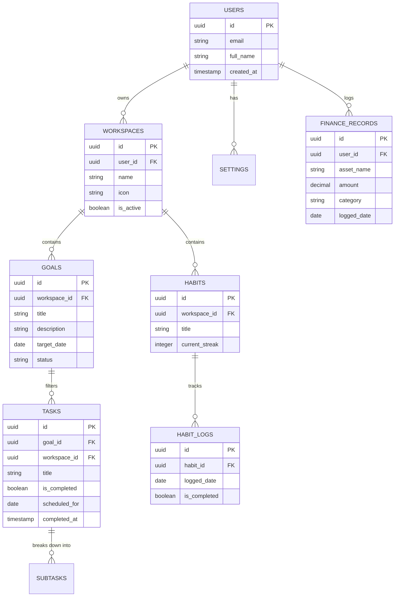

# Phase 5: Database Design

This document details the PostgreSQL database schema, including Entities, Relationships, ER Diagrams, Normalization rules, and Indexes, specifically tailored for Supabase.

---

## 1. Entity-Relationship (ER) Diagram

---

## 2. Core Entities & Schema Details

### `users` (Managed by Supabase Auth)
- Handled primarily by `auth.users` in Supabase.
- We will use a `public.profiles` table linked via a trigger for custom user data.

### `workspaces`
| Column | Type | Constraints |
|--------|------|-------------|
| id | UUID | PRIMARY KEY, DEFAULT gen_random_uuid() |
| user_id | UUID | FOREIGN KEY (profiles.id) ON DELETE CASCADE |
| name | TEXT | NOT NULL |
| icon | TEXT | DEFAULT 'Box' |
| is_default | BOOLEAN | DEFAULT false |

### `goals`
| Column | Type | Constraints |
|--------|------|-------------|
| id | UUID | PRIMARY KEY |
| workspace_id | UUID | FOREIGN KEY (workspaces.id) ON DELETE CASCADE |
| title | TEXT | NOT NULL |
| status | TEXT | 'active', 'completed', 'archived' |

### `tasks`
| Column | Type | Constraints |
|--------|------|-------------|
| id | UUID | PRIMARY KEY |
| workspace_id | UUID | FOREIGN KEY |
| goal_id | UUID | FOREIGN KEY (Nullable) |
| title | TEXT | NOT NULL |
| is_completed| BOOLEAN | DEFAULT false |
| scheduled_for| DATE | DEFAULT CURRENT_DATE |

### `finance_records`
| Column | Type | Constraints |
|--------|------|-------------|
| id | UUID | PRIMARY KEY |
| user_id | UUID | FOREIGN KEY |
| asset_name | TEXT | NOT NULL |
| amount | NUMERIC | NOT NULL |
| category | TEXT | 'equity', 'cash', 'crypto', etc. |

---

## 3. Normalization & Optimization

- **No Duplication:** Instead of storing the user's ID on every single task, tasks inherit ownership through their `workspace_id`. However, for Row Level Security (RLS) performance in Supabase, we *will* denormalize slightly by keeping `user_id` on the `tasks` table to make security policies highly performant.
- **Cascading Deletes:** Deleting a Workspace will automatically delete all associated Goals, Tasks, and Habits via `ON DELETE CASCADE`.

## 4. Required Indexes
To ensure queries remain instantly responsive as the database grows, we will apply B-Tree indexes to the following heavily queried columns:
- `CREATE INDEX idx_tasks_user_id ON tasks(user_id);`
- `CREATE INDEX idx_tasks_workspace_id ON tasks(workspace_id);`
- `CREATE INDEX idx_tasks_scheduled_for ON tasks(scheduled_for);`
- `CREATE INDEX idx_goals_workspace_id ON goals(workspace_id);`
- `CREATE INDEX idx_finance_user_id ON finance_records(user_id);`
- `CREATE INDEX idx_habit_logs_date ON habit_logs(logged_date);`
