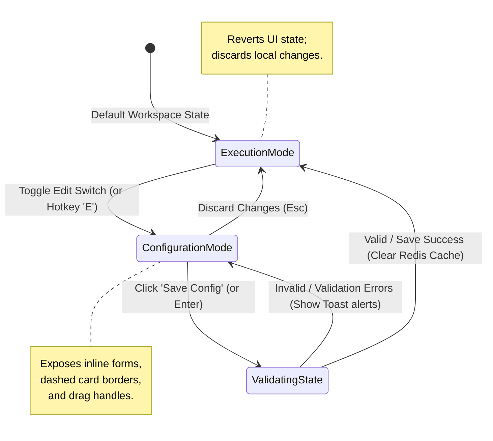

# 06. Edit Mode Architecture & UX Flow

To prevent UI clutter and ensure deep focus during execution, ProdOS V2 uses a single **Global Edit Switcher** located in the bottom-right control center. This replaces scattered inline update buttons with a clean state change.

---

## 1. Visual Transformations by Mode

When toggling the workspace state, components dynamically update their rendered HTML tags and styling details:

| UI Component | Execution Mode (Default) | Configuration Mode (Edit Mode ON) |
| :--- | :--- | :--- |
| **Grid Panel Cards** | Borderless/Muted glass pane. | Reveals a dashed outline `border border-dashed border-white/20`. |
| **Tasks list** | Click checks off task; displays checkboxes. | Checkbox hidden; displays drag reorder handles (`⋮⋮`) and trash icons. |
| **Labels & Text** | Read-only static monospace text. | Converts to inline input elements with subtle under-borders. |
| **Domain Cards** | Displays dynamic KPI summaries and trends. | Reveals `[+] Add KPI` button and target config inputs. |
| **Goals list** | Shows target value progress bars. | Exposes parent goal selector dropdowns to change hierarchy. |

---

## 2. Mermaid State Transition Diagram

This state machine details how local state edits are queued, validated, and pushed to Supabase:

---

## 3. Configuration Action Hooks (Save/Discard)

* **Save Actions Bar:** When in Configuration Mode, a floating panel slips up directly above the bottom Dock. It contains:
  1. `Save Changes` button (Tech Green fill, triggers database upserts).
  2. `Cancel` button (Transparent gray outline, returns to Execution Mode).
* **Keyboard Safeties:** Pressing `Esc` triggers a warning modal confirming if the user wants to discard unsaved configuration changes.
* **Auto-Eviction Trigger:** On a successful Save configuration operation, the system executes cache purges in Redis, ensuring dashboard analytics recalculate accurately.
