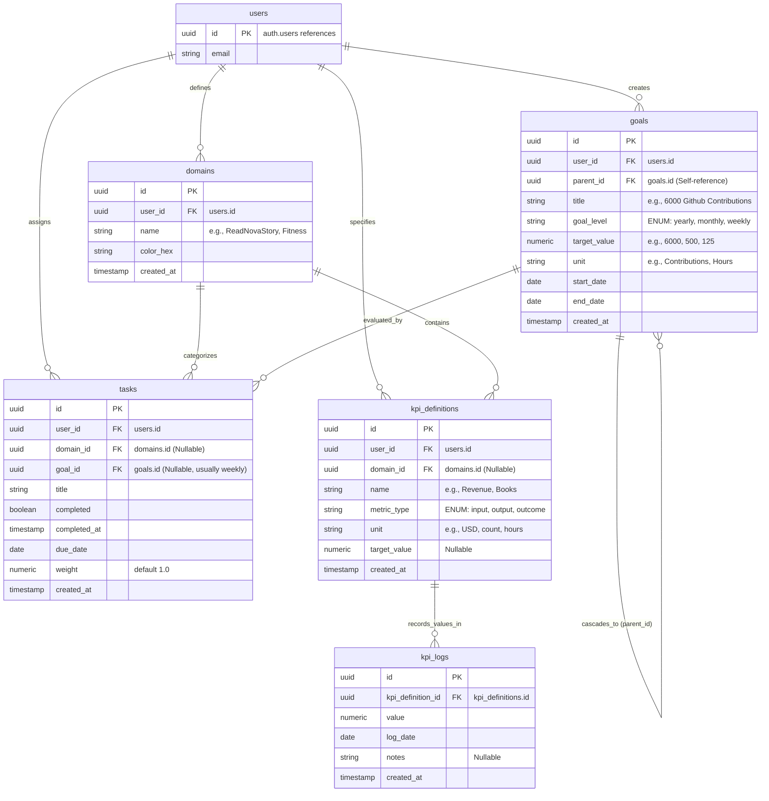

# 01. Core Architecture Overview & ER Diagram

ProdOS Mark 2 implements an execution-focused life operating system where users manage their time, goals, and metrics across focus areas called **Domains**. 

---

## Core Hierarchy

```
   USER (auth.users)
    │
    ├── DOMAINS (Focus areas, e.g., ReadNovaStory, Fitness)
    │     │
    │     └── TASKS (Belongs to 0 or 1 Domain)
    │           │
    │           └── GOALS (Optional link: Tasks drive Weekly Target progress)
    │
    ├── GOALS (Hierarchical cascading targets)
    │     │
    │     └── Yearly Goal ──> Monthly Target ──> Weekly Target
    │
    └── KPI SYSTEM (Custom metrics logged daily/weekly)
          │
          └── KPI Definitions (Input, Output, Outcome) ──> KPI Logs
```

---

## Entity Descriptions

### 1. User
A tenant in the system, mapped to Supabase Authentication (`auth.users`). Every record in the database is scoped to a specific user to ensure multi-tenancy isolation.

### 2. Domain
A logical categorization representing a core focus area (e.g., Investments, Fitness). Domains are completely customizable. Tasks and KPIs can be associated with a specific domain.

### 3. Task
The base unit of execution. A task:
* Belongs to exactly **one** domain (or **zero** if it is a "Global Task").
* Can optionally link to a **Goal** (specifically, a Weekly Target) to contribute progress.
* Can be completed or uncompleted.

### 4. Goal
A cascading hierarchical target structure:
* **Yearly Goals** cascade down to **Monthly Targets**.
* **Monthly Targets** cascade down to **Weekly Targets**.
* **Weekly Targets** are driven directly by **Tasks** (Daily Actions).
* Progress cascades upwards: completing a task drives the Weekly Target progress, which drives the Monthly Target progress, which drives the Yearly Goal progress.

### 5. KPI Definition & Log
A highly flexible, dynamic metric tracking system:
* **KPI Definition:** Defines a custom metric (e.g., "Revenue", "Books Read", "Weight Loss") categorized by type:
  1. **Input Metrics:** Action-oriented metrics (e.g., Hours spent studying, cold outreach counts).
  2. **Output Metrics:** Immediate results (e.g., Tasks completed, lines written, features shipped).
  3. **Outcome Metrics:** Delayed long-term results (e.g., Revenue generated, weight lost, net worth).
* **KPI Log:** Records daily or weekly values against a KPI Definition.

---

## Mermaid ER Diagram


