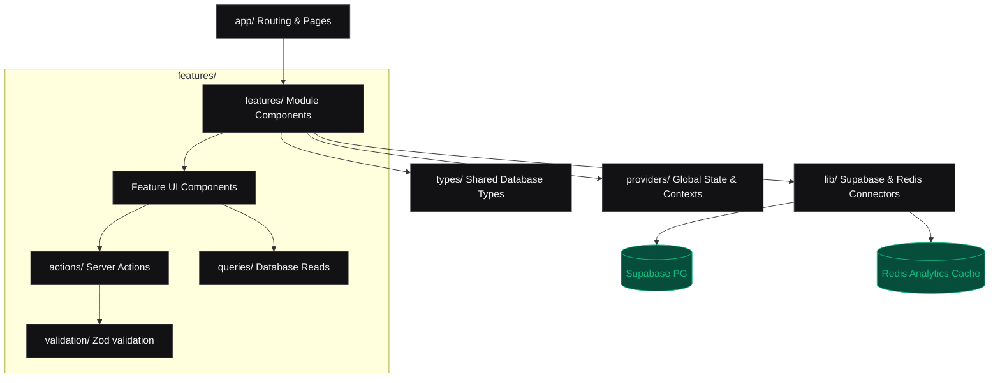

# ProdOS V2 — Phase 1 Foundation Architecture Specification

This document defines the core architecture, data structures, boundaries, and standards for the ProdOS V2 system. It has been designed by a Staff Software Architect to scale over 5+ years and serve as the single source of truth for all subsequent implementation phases.

---

## 1. Folder Structure & Modular Responsibilities

ProdOS V2 uses a **Feature-Based Modular Structure** to isolate domains of business logic and prevent the visual/routing layers from becoming tightly coupled to data models.

```
/
├── app/                  # NEXT.JS 14 APP ROUTER (Routing & Page Entry Only)
│   ├── layout.tsx        # Global HTML Shell & Root Providers mounting
│   ├── page.tsx          # Marketing / Root redirection
│   └── dashboard/        # Dashboard layout boundary
├── features/             # BOUNDED CONTEXTS (Core domain business logic)
│   ├── domains/          # Focus areas module
│   ├── goals/            # Yearly/Monthly/Weekly target module
│   ├── tasks/            # Execution action item module
│   ├── kpis/             # Custom runtime metrics tracking module
│   └── analytics/        # Aggregate telemetry calculator module
├── components/           # SHARED UI COMPONENTS (Purely stateless components)
│   └── ui/               # Core design tokens elements (buttons, inputs, glass panes)
├── lib/                  # INFRASTRUCTURE UTILITIES (External integrations)
│   ├── supabase/         # Client & Server-side auth connectors
│   └── redis/            # Redis client wrapper & caching functions
├── hooks/                # SHARED CLIENT HOOKS (Cross-feature interface hooks)
├── providers/            # GLOBAL CONTEXTS (Edit mode, Theme, Session providers)
├── styles/               # DESIGN SYSTEM AND STYLING (Tailwind theme configuration)
└── types/                # GLOBAL TYPES (TS models mapping database structures)
```

### Purpose of Features Directory
Each subdirectory inside `features/` defines its own boundary. They are strictly structured as:
* `/actions`: Database mutations (Server Actions) executed from client UI.
* `/queries`: Read-only queries fetching database/cache views.
* `/types`: Type definitions scoped *only* to this domain.
* `/validation`: Zod schemas validating action inputs.
* `/components`: Sub-feature components (e.g. `GoalRow` in goals module) mounted inside standard page layouts.

---

## 2. Foundation Architecture Diagram

This diagram displays the unidirectional dependency flow across ProdOS V2 layers, maintaining clean separation of concerns.



---

## 3. Database Strategy & Schemas

### Ownership Model
All tables link to the Supabase User UID (`auth.users.id`). Rows are protected under Row Level Security (RLS) policies enforcing `auth.uid() = user_id`.

### Schemas & DDL Blueprint

```sql
-- 1. Users Profile (extends auth.users)
CREATE TABLE profiles (
    id UUID PRIMARY KEY REFERENCES auth.users (id) ON DELETE CASCADE,
    display_name VARCHAR(255),
    timezone VARCHAR(50) NOT NULL DEFAULT 'UTC',
    created_at TIMESTAMPTZ NOT NULL DEFAULT now()
);

-- 2. Focus Domains
CREATE TABLE domains (
    id UUID PRIMARY KEY DEFAULT gen_random_uuid(),
    user_id UUID NOT NULL REFERENCES auth.users (id) ON DELETE CASCADE,
    name VARCHAR(255) NOT NULL,
    color_hex VARCHAR(7) NOT NULL DEFAULT '#10B981',
    created_at TIMESTAMPTZ NOT NULL DEFAULT now(),
    updated_at TIMESTAMPTZ NOT NULL DEFAULT now(),
    UNIQUE (user_id, name)
);

-- 3. Hierarchical Goals
CREATE TYPE goal_level AS ENUM ('yearly', 'monthly', 'weekly');
CREATE TABLE goals (
    id UUID PRIMARY KEY DEFAULT gen_random_uuid(),
    user_id UUID NOT NULL REFERENCES auth.users (id) ON DELETE CASCADE,
    parent_id UUID REFERENCES goals (id) ON DELETE CASCADE,
    title VARCHAR(255) NOT NULL,
    goal_level goal_level NOT NULL,
    target_value NUMERIC(12, 2) NOT NULL DEFAULT 100.00,
    unit VARCHAR(50) NOT NULL DEFAULT '%',
    start_date DATE NOT NULL,
    end_date DATE NOT NULL,
    created_at TIMESTAMPTZ NOT NULL DEFAULT now(),
    updated_at TIMESTAMPTZ NOT NULL DEFAULT now(),
    CONSTRAINT check_dates CHECK (start_date <= end_date)
);

-- 4. Unified Execution Tasks
CREATE TABLE tasks (
    id UUID PRIMARY KEY DEFAULT gen_random_uuid(),
    user_id UUID NOT NULL REFERENCES auth.users (id) ON DELETE CASCADE,
    domain_id UUID REFERENCES domains (id) ON DELETE SET NULL,
    goal_id UUID REFERENCES goals (id) ON DELETE SET NULL,
    title TEXT NOT NULL,
    completed BOOLEAN NOT NULL DEFAULT false,
    completed_at TIMESTAMPTZ,
    due_date DATE NOT NULL DEFAULT CURRENT_DATE,
    weight NUMERIC(5, 2) NOT NULL DEFAULT 1.00,
    created_at TIMESTAMPTZ NOT NULL DEFAULT now(),
    updated_at TIMESTAMPTZ NOT NULL DEFAULT now()
);

-- 5. KPI Definitions (Dynamic metric templates)
CREATE TYPE kpi_metric_type AS ENUM ('input', 'output', 'outcome');
CREATE TABLE kpi_definitions (
    id UUID PRIMARY KEY DEFAULT gen_random_uuid(),
    user_id UUID NOT NULL REFERENCES auth.users (id) ON DELETE CASCADE,
    domain_id UUID NOT NULL REFERENCES domains (id) ON DELETE CASCADE,
    name VARCHAR(255) NOT NULL,
    metric_type kpi_metric_type NOT NULL,
    unit VARCHAR(50) NOT NULL,
    target_value NUMERIC(12, 2),
    created_at TIMESTAMPTZ NOT NULL DEFAULT now(),
    updated_at TIMESTAMPTZ NOT NULL DEFAULT now(),
    UNIQUE (user_id, domain_id, name)
);

-- 6. KPI Log Records (Daily metrics logging)
CREATE TABLE kpi_logs (
    id UUID PRIMARY KEY DEFAULT gen_random_uuid(),
    kpi_definition_id UUID NOT NULL REFERENCES kpi_definitions (id) ON DELETE CASCADE,
    value NUMERIC(12, 2) NOT NULL,
    log_date DATE NOT NULL DEFAULT CURRENT_DATE,
    notes TEXT,
    created_at TIMESTAMPTZ NOT NULL DEFAULT now(),
    UNIQUE (kpi_definition_id, log_date)
);
```

### Indexing Strategy
* **`idx_goals_user_parent`:** `ON goals (user_id, parent_id) WHERE parent_id IS NOT NULL` (recursive joins performance).
* **`idx_tasks_active`:** `ON tasks (user_id, due_date) WHERE completed = false` (daily task filter optimization).
* **`idx_kpi_logs_date`:** `ON kpi_logs (kpi_definition_id, log_date DESC)` (analytics time-series queries).

---

## 4. Authentication Foundation

We integrate **Supabase Auth** using Next.js Server Side components. 

### Middleware Router Guard Layout
A global middleware script intercepts page views, checking if user sessions exist prior to rendering:
```typescript
// lib/supabase/middleware.ts
import { createServerClient } from "@supabase/ssr";
import { NextResponse, type NextRequest } from "next/server";

export async function updateSession(request: NextRequest) {
  let response = NextResponse.next({ request });

  const supabase = createServerClient(
    process.env.NEXT_PUBLIC_SUPABASE_URL!,
    process.env.NEXT_PUBLIC_SUPABASE_ANON_KEY!,
    {
      cookies: {
        getAll() { return request.cookies.getAll(); },
        setAll(cookiesToSet) {
          cookiesToSet.forEach(({ name, value }) => request.cookies.set(name, value));
          response = NextResponse.next({ request });
          cookiesToSet.forEach(({ name, value, options }) => response.cookies.set(name, value, options));
        },
      },
    }
  );

  const { data: { user } } = await supabase.auth.getUser();

  // Route Guard Boundaries
  const isProtectedRoute = request.nextUrl.pathname.startsWith("/dashboard");
  
  if (isProtectedRoute && !user) {
    return NextResponse.redirect(new URL("/login", request.url));
  }

  return response;
}
```

---

## 5. Validation Layer (Zod)

Every mutation (Server Action) utilizes Zod validators inside `/validation` folders.

### Standard Response Format
To standardize operations, validation errors return a JSON envelope:
```typescript
export interface ActionResponse<T> {
  success: boolean;
  data?: T;
  error?: {
    code: "VALIDATION_ERROR" | "DATABASE_ERROR" | "UNAUTHORIZED";
    message: string;
    details?: { field: string; issue: string }[];
  };
}
```

### Sample Validation Architecture
```typescript
import { z } from "zod";

export const TaskUpsertSchema = z.object({
  id: z.string().uuid().optional(),
  domainId: z.string().uuid().nullable(),
  goalId: z.string().uuid().nullable(),
  title: z.string().min(1, "Task title is required").max(1000),
  dueDate: z.string().regex(/^\d{4}-\d{2}-\d{2}$/, "Must be YYYY-MM-DD"),
  weight: z.number().positive().default(1.00)
});
```

---

## 6. Redis Foundation (Cache-Aside Engine)

Redis caches dynamic score and velocity metrics to prevent database query degradation.

### Key Naming Conventions
* **Score Analytics Cache:** `user:{userId}:analytics` (holds combined dashboard telemetry metrics).
* **TTL Config:** 86,400 seconds (24 hours).

### Helper Client Wrapper
```typescript
// lib/redis/client.ts
import { Redis } from "@upstash/redis";

export const redis = new Redis({
  url: process.env.UPSTASH_REDIS_REST_URL!,
  token: process.env.UPSTASH_REDIS_REST_TOKEN!,
});

export async function evictCache(userId: string) {
  const key = `user:${userId}:analytics`;
  await redis.del(key);
}
```

---

## 7. Design System Foundation (Tailwind Theme Tokens)

The theme configuration is defined entirely inside `tailwind.config.ts` using CSS variables to support dynamic theme switching (default, green, amber, rose, mono) at runtime.

### Variable Configurations
```typescript
// tailwind.config.ts
import type { Config } from "tailwindcss";

const config: Config = {
  content: ["./app/**/*.{ts,tsx}", "./components/**/*.{ts,tsx}", "./features/**/*.{ts,tsx}"],
  theme: {
    extend: {
      colors: {
        surface: "var(--color-surface)", // maps to pitch black #09090B
        card: "var(--color-card)",       // maps to deep charcoal #18181B
        border: "var(--color-border)",   // maps to #27272A
        brand: {
          500: "var(--color-brand-500)", // Dynamic based on theme selection
          600: "var(--color-brand-600)",
        },
        status: {
          success: "#10B981", // Green
          warning: "#F59E0B", // Amber
          error: "#EF4444",   // Red
        }
      },
      fontFamily: {
        sans: ["var(--font-sans)", "system-ui"],
        mono: ["var(--font-mono)", "monospace"],
      },
      borderRadius: {
        brand: "4px", // sharp, tool-like corners
      }
    },
  },
  plugins: [],
};
export default config;
```

---

## 8. Global Edit Mode Foundation

Edit Mode acts as a **Global Context State Provider** that controls inline editing options.

### Context Mapping
```typescript
// providers/edit-mode-provider.tsx
"use client";

import React, { createContext, useContext, useState, useEffect } from "react";

type Mode = "execution" | "configuration";

interface EditModeContextType {
  mode: Mode;
  isEditMode: boolean;
  toggleMode: () => void;
}

const EditModeContext = createContext<EditModeContextType | undefined>(undefined);

export function EditModeProvider({ children }: { children: React.ReactNode }) {
  const [mode, setMode] = useState<Mode>("execution");

  const toggleMode = () => {
    setMode((prev) => (prev === "execution" ? "configuration" : "execution"));
  };

  return (
    <EditModeContext.Provider value={{ mode, isEditMode: mode === "configuration", toggleMode }}>
      {children}
    </EditModeContext.Provider>
  );
}

export function useEditMode() {
  const context = useContext(EditModeContext);
  if (!context) throw new Error("useEditMode must be used within EditModeProvider");
  return context;
}
```

---

## 9. Engineering Standards

To enforce code cleanlines, future phases must adhere to these structural conventions:

### Filenames & Formats
* **Query hooks:** Pinned to `/queries` folders, named `get[Entity].ts` (e.g. `getTasks.ts`). Must return read-only data.
* **Mutation hooks:** Pinned to `/actions` folders, named `upsert[Entity].ts` or `delete[Entity].ts`. Must be designated `"use server"`.
* **Component folders:** Named matching standard PascalCase (e.g., `features/goals/components/GoalRow.tsx`).

### Mutation Data Flow Constraints
1. **Validate inputs** with Zod schema.
2. **Authorize user session** using server-side auth client.
3. **Execute DB update** in Supabase.
4. **Purge Redis cache key** (`user:${userId}:analytics`) to force metrics updates.

---

## 10. Risks & Tradeoffs

* **Redis Caching Constraints:** By caching the combined daily dashboard analytics in Redis under one key, we achieve sub-millisecond page loads. However, the cache *must* be evicted on any task change. If a server mutation fails to evict the key, users will see stale progress.
* **Views Recursion Limits:** PostgreSQL dynamic views aggregate progress cascading from Weekly $\rightarrow$ Monthly $\rightarrow$ Yearly. Since the depth is locked at 3 levels, performance remains high. If deep arbitrary goal nestings are introduced in the future, SQL recursion limits could impact query performance, requiring stored triggers.

---

## Readiness Review & Transition Answer

| Requirement Checklist | Status |
| :--- | :--- |
| Modular features boundary defined | **COMPLETED** |
| Dynamic computed views strategy planned | **COMPLETED** |
| Dynamic Custom KPIs logic designed (`kpi_definitions`, `kpi_logs`) | **COMPLETED** |
| Global Edit/Configuration mode provider written | **COMPLETED** |
| Database multi-tenant RLS schema configured | **COMPLETED** |

### **Is ProdOS V2 Foundation ready for Phase 2 (Domain Engine)?**
### **YES.**
The architecture has been designed to allow the Domain Engine module to implement actions, schemas, and queries in complete isolation, using the folder layouts, auth methods, and caching systems established here.
