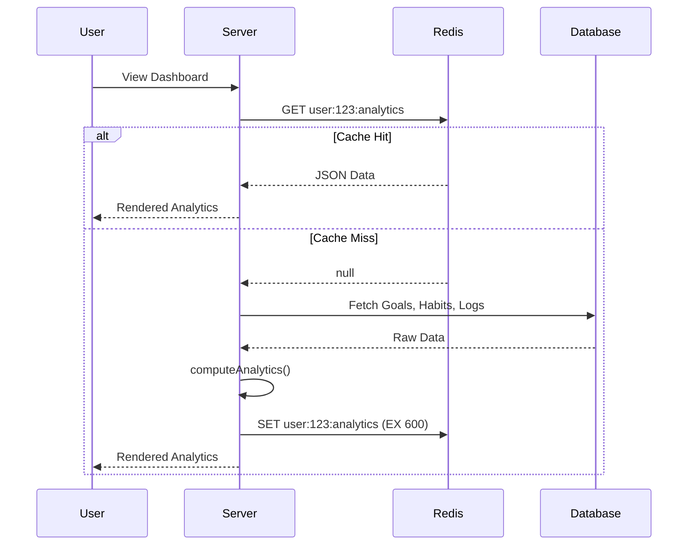

# Redis Caching Architecture

The productivity app uses Redis (via `ioredis`) to cache computationally expensive analytics and stats, ensuring a fast and responsive dashboard experience.

## Strategy: Cache-Aside (Lazy Loading)

1.  **Read**: The app checks Redis for a key (e.g., `user:{id}:analytics`).
2.  **Hit**: If found, it returns the cached data immediately.
3.  **Miss**: If not found, it fetches the raw data from Supabase, processes it through the analytics layer, stores the result in Redis with a TTL, and returns it.

## Implementation Details

- **Location**: `lib/cache/redis.ts` contains the client singleton and helper functions.
- **Serialization**: Data is stored as JSON strings.
- **TTL**: Cached analytics expire automatically after **10 minutes** (`600s`).
- **Isolation**: Cache keys are scoped to the `userId` to prevent data leakage between users.

## Cache Invalidation

To ensure data consistency, the cache is invalidated whenever a user performs a state-changing action:
- **Goals**: Creating, deleting, or toggling a goal.
- **Habits**: Creating, deleting, or logging a habit for today.

The key targeted for invalidation is `user:{userId}:analytics`.

## Example Flow

## Logging
The system logs `[Cache] HIT`, `[Cache] MISS`, and `[Cache] INVALIDATE` events to the server console for easy monitoring of cache efficiency.
